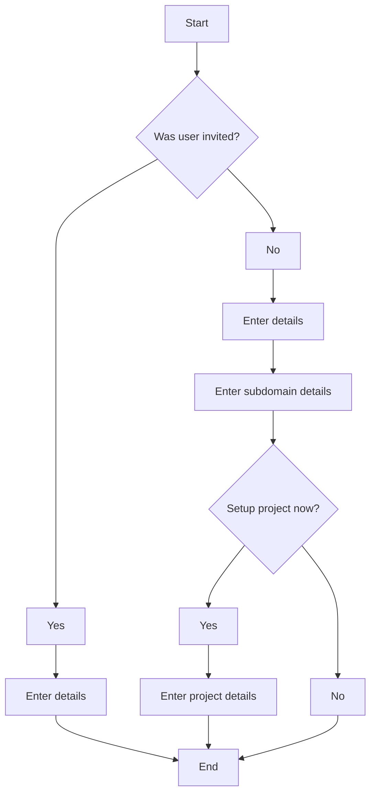

# User registration

User registration can be done either from scratch or after receiving an invite email. The steps taken and information gathered depend on which path is taken. The chart below outlines the different flows.

